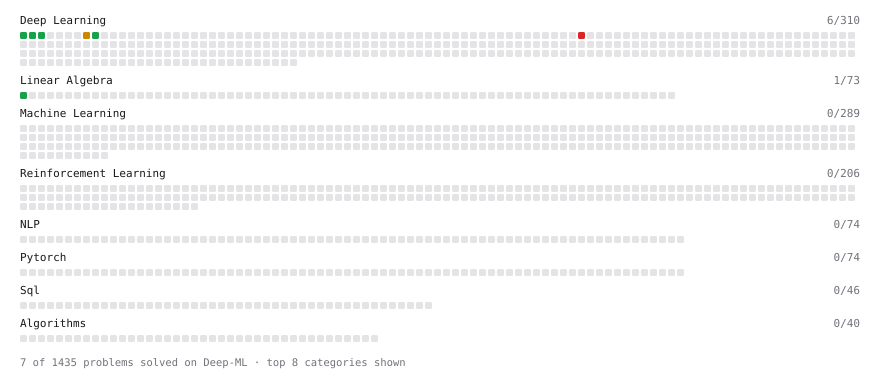

# Deep-ML

My machine learning practice from [Deep-ML](https://www.deep-ml.com). Every solution here was written by hand.

**5** solved · 5 problems · 0 labs · 0 math

[**Browse the interactive portfolio**](https://Youngboy01.github.io/deep-ml/) to replay this filling in over time.

## Problems

| | Difficulty | Solved | |
| --- | --- | --- | --- |
| [Implement ReLU Activation Function](https://www.deep-ml.com/problems/42) | easy | 2025-12-07 | [solution](problems/0042-implement-relu-activation-function) |
| [Matrix-Vector Dot Product](https://www.deep-ml.com/problems/1) | easy | 2025-12-07 | [solution](problems/0001-matrix-vector-dot-product) |
| [Softmax Activation Function Implementation ](https://www.deep-ml.com/problems/23) | easy | 2025-12-07 | [solution](problems/0023-softmax-activation-function-implementation) |
| [Simple Convolutional 2D Layer](https://www.deep-ml.com/problems/41) | medium | 2025-12-07 | [solution](problems/0041-simple-convolutional-2d-layer) |
| [3D CNN Forward Pass Implementation](https://www.deep-ml.com/problems/230) | hard | 2025-12-11 | [solution](problems/0230-3d-cnn-forward-pass-implementation) |

---

_This file is regenerated by Deep-ML on every push._
